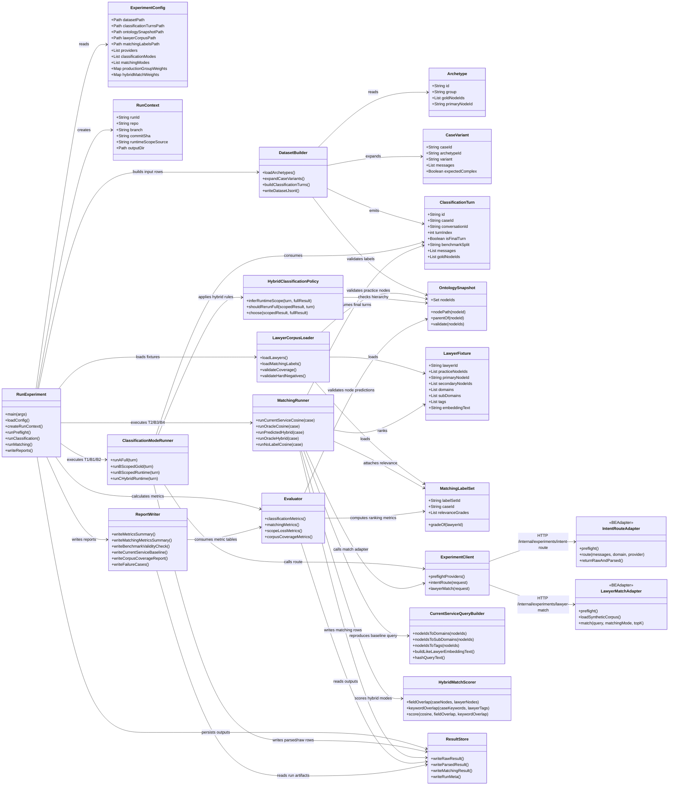

# AI 법률 분야 분류 및 변호사 매칭 실험 파이프라인 클래스 다이어그램

기준 문서: [ai-complex-law-classification-experiment.md](../ai-complex-law-classification-experiment.md)

이 다이어그램은 `runner`가 담당하는 orchestration과 BE local/test adapter가 담당하는 실제 classifier/matching 호출 경계를 분리해서 표현한다. `IntentRouteAdapter`와 `LawyerMatchAdapter`는 SHIELD BE 안의 local/test profile 전용 adapter이고, 나머지는 `EXPERIMENT/runner`의 Python 모듈이다.

## 해석 기준

- `RunExperiment`는 orchestration만 담당한다. classifier prompt, ontology scoping, provider client, parser, 운영 cosine query 생성은 직접 재구현하지 않는다.
- `ClassificationModeRunner`는 Layer 1 분류 benchmark인 `B1_LAYER1_TURN_CLASSIFICATION`, `B2_SCOPE_LOSS`를 실행한다.
- `MatchingRunner`는 final turn만 기본 입력으로 사용해 `B3_CURRENT_MATCHING_BASELINE`, `B4_MATCHING_ABLATION`을 실행한다.
- `CurrentServiceQueryBuilder`는 `PREDICTED_LABELS_COSINE_ONLY`가 현재 `LawyerMatchingService`와 같은 query text를 쓰는지 검증하기 위한 runner-side mirror다. 실제 운영 경로 검증은 `LawyerMatchAdapter` preflight에서 한 번 더 수행한다.
- `HybridMatchScorer`는 운영 코드가 아니라 실험 비교군이다. final test 실행 전 `ExperimentConfig.hybridMatchWeights`가 고정되어야 한다.
