# AI 법률 분야 분류 및 변호사 매칭 실험 파이프라인 클래스 다이어그램

기준 문서: [ai-complex-law-classification-experiment.md](../ai-complex-law-classification-experiment.md)

이 다이어그램은 실험 runner를 GoF/GRASP 관점에 맞춰 나눈 구현 후보 구조다. 핵심 원칙은 다음과 같다.

- `RunExperiment`는 composition root이자 thin controller로만 둔다.
- 큰 실행 흐름은 facade 성격의 pipeline 객체가 맡는다.
- classification mode와 matching mode는 Strategy로 분리한다.
- ontology path 해석은 `OntologyMapper`가 맡아 Information Expert 책임을 지킨다.
- metric 계산은 evaluator별로 나누어 High Cohesion을 유지한다.
- 파일 저장은 `ResultSink` 뒤로 숨겨 runner와 저장 방식의 결합을 낮춘다.

```mermaid
classDiagram
direction LR

class RunExperiment {
  +main(args)
  +bootstrap()
  +execute()
}

class ExperimentPipelineFacade {
  +run()
  +runPreflight()
  +runClassificationTrack()
  +runMatchingTrack()
  +runEvaluation()
  +runReporting()
}

class PreflightPipeline {
  +checkConfig()
  +checkProviders()
  +checkDataset()
  +checkLawyerCorpus()
  +checkAdapters()
}

class ClassificationExperimentPipeline {
  +run(turns, providers)
  +executeMode(turn, provider, mode)
}

class MatchingExperimentPipeline {
  +run(finalTurns, selectedClassifierArm)
  +executeMode(caseContext, mode)
}

class EvaluationPipeline {
  +evaluateClassification()
  +evaluateMatching()
  +evaluateBenchmarkValidity()
}

class ReportingPipeline {
  +writeReports()
}

class ExperimentConfig {
  +Path datasetPath
  +Path classificationTurnsPath
  +Path ontologySnapshotPath
  +Path lawyerCorpusPath
  +Path matchingLabelsPath
  +List providers
  +List classificationModes
  +List matchingModes
  +Map productionGroupWeights
  +Map hybridMatchWeights
}

class RunContext {
  +String runId
  +String repo
  +String branch
  +String commitSha
  +String runtimeScopeSource
  +Path outputDir
}

class RunContextFactory {
  +create(config)
  +captureGitMetadata()
}

class DatasetRepository {
  +loadArchetypes()
  +loadCaseVariants()
  +loadClassificationTurns()
  +saveCaseVariants()
  +saveClassificationTurns()
}

class DatasetBuilder {
  +expandCaseVariants(archetypes)
  +buildClassificationTurns(caseVariants)
}

class Archetype {
  +String id
  +String group
  +List goldNodeIds
  +String primaryNodeId
}

class CaseVariant {
  +String caseId
  +String archetypeId
  +String variant
  +List messages
  +Boolean expectedComplex
}

class ClassificationTurn {
  +String id
  +String caseId
  +String conversationId
  +int turnIndex
  +Boolean isFinalTurn
  +String benchmarkSplit
  +List messages
  +List goldNodeIds
}

class OntologySnapshot {
  +Set nodeIds
  +parentOf(nodeId)
  +exists(nodeId)
}

class OntologyMapper {
  +validate(nodeIds)
  +toDomain(nodeId)
  +toSubDomain(nodeId)
  +toTag(nodeId)
  +toHierarchyScore(pred, gold)
}

class LawyerCorpusRepository {
  +loadLawyers()
  +loadMatchingLabels()
  +saveGeneratedCorpus()
}

class LawyerCorpusValidator {
  +validateCoverage(lawyers)
  +validateHardNegatives(lawyers)
  +validateLabels(labels, lawyers)
}

class LawyerFixture {
  +String lawyerId
  +List practiceNodeIds
  +String primaryNodeId
  +List secondaryNodeIds
  +List domains
  +List subDomains
  +List tags
  +String embeddingText
}

class MatchingLabelSet {
  +String labelSetId
  +String caseId
  +List relevanceGrades
  +gradeOf(lawyerId)
}

class ExperimentClient {
  +intentRoute(request)
  +lawyerMatch(request)
}

class IntentRouteGateway {
  <<Adapter>>
  +preflight()
  +route(messages, domain, provider)
}

class LawyerMatchGateway {
  <<Adapter>>
  +preflight()
  +loadSyntheticCorpus()
  +match(query, matchingMode, topK)
}

class ClassificationModeStrategy {
  <<interface>>
  +modeName()
  +execute(turn, provider)
}

class AFullClassificationStrategy {
  +execute(turn, provider)
}

class BScopedGoldStrategy {
  +execute(turn, provider)
}

class BScopedRuntimeStrategy {
  +execute(turn, provider)
}

class CHybridRuntimeStrategy {
  +execute(turn, provider)
}

class ClassificationModeRegistry {
  +get(modeName)
  +allEnabled()
}

class RuntimeScopeResolver {
  +resolveFromConsultationState()
  +resolveFromFullResult()
}

class HybridClassificationPolicy {
  +shouldRerunFull(scopedResult, turn)
  +choose(scopedResult, fullResult)
}

class MatchingModeStrategy {
  <<interface>>
  +modeName()
  +execute(caseContext)
}

class CurrentServiceCosineStrategy {
  +execute(caseContext)
}

class OracleCosineStrategy {
  +execute(caseContext)
}

class PredictedHybridStrategy {
  +execute(caseContext)
}

class OracleHybridStrategy {
  +execute(caseContext)
}

class NoLabelCosineStrategy {
  +execute(caseContext)
}

class MatchingModeRegistry {
  +get(modeName)
  +allEnabled()
}

class CurrentServiceQueryBuilder {
  +buildPredictedLabelQuery(caseContext)
  +buildOracleLabelQuery(caseContext)
  +buildContentOnlyQuery(caseContext)
  +hashQueryText(queryText)
}

class HybridMatchScorer {
  +fieldOverlap(caseNodes, lawyerNodes)
  +keywordOverlap(caseKeywords, lawyerTags)
  +score(cosine, fieldOverlap, keywordOverlap)
}

class ResultSink {
  <<interface>>
  +writeRawResult(row)
  +writeParsedResult(row)
  +writeMatchingResult(row)
  +writeRunMeta(meta)
}

class JsonlResultSink {
  +writeRawResult(row)
  +writeParsedResult(row)
  +writeMatchingResult(row)
  +writeRunMeta(meta)
}

class ResultRepository {
  +readClassificationRows()
  +readMatchingRows()
  +readRunMeta()
}

class ClassificationEvaluator {
  +parseSuccessRate()
  +microF1()
  +complexRecall()
  +driftRate()
}

class ScopeLossEvaluator {
  +scopedOntologyLoss()
  +underClassificationRate()
}

class MatchingEvaluator {
  +hitAtK()
  +recallAtK()
  +ndcgAtK()
  +mrr()
}

class BenchmarkValidityEvaluator {
  +configErrorCount()
  +providerFallbackRate()
  +corpusCoverage()
  +splitLeakage()
}

class MetricAggregator {
  +stressScore()
  +productionWeightedScore()
  +groupMacroAverage()
}

class ReportWriter {
  +writeMetricsSummary()
  +writeMatchingMetricsSummary()
  +writeBenchmarkValidityCheck()
  +writeCurrentServiceBaseline()
  +writeCorpusCoverageReport()
  +writeFailureCases()
}

RunExperiment --> ExperimentConfig : loads
RunExperiment --> RunContextFactory : creates context
RunExperiment --> ExperimentPipelineFacade : delegates

RunContextFactory --> RunContext : creates

ExperimentPipelineFacade --> PreflightPipeline : orchestrates
ExperimentPipelineFacade --> ClassificationExperimentPipeline : orchestrates
ExperimentPipelineFacade --> MatchingExperimentPipeline : orchestrates
ExperimentPipelineFacade --> EvaluationPipeline : orchestrates
ExperimentPipelineFacade --> ReportingPipeline : orchestrates

PreflightPipeline --> ExperimentConfig : checks
PreflightPipeline --> DatasetRepository : validates input files
PreflightPipeline --> LawyerCorpusValidator : validates corpus
PreflightPipeline --> ExperimentClient : checks adapters

DatasetRepository --> Archetype : loads
DatasetRepository --> CaseVariant : loads/saves
DatasetRepository --> ClassificationTurn : loads/saves
DatasetBuilder --> Archetype : reads
DatasetBuilder --> CaseVariant : creates
DatasetBuilder --> ClassificationTurn : creates
DatasetBuilder --> OntologyMapper : validates labels

OntologyMapper --> OntologySnapshot : uses hierarchy

LawyerCorpusRepository --> LawyerFixture : loads/saves
LawyerCorpusRepository --> MatchingLabelSet : loads
LawyerCorpusValidator --> LawyerFixture : validates
LawyerCorpusValidator --> MatchingLabelSet : validates
LawyerCorpusValidator --> OntologyMapper : validates practice nodes

ExperimentClient --> IntentRouteGateway : delegates route
ExperimentClient --> LawyerMatchGateway : delegates match

ClassificationExperimentPipeline --> DatasetRepository : reads turns
ClassificationExperimentPipeline --> ClassificationModeRegistry : selects strategy
ClassificationExperimentPipeline --> ResultSink : writes results
ClassificationModeRegistry --> ClassificationModeStrategy : returns
ClassificationModeStrategy <|.. AFullClassificationStrategy
ClassificationModeStrategy <|.. BScopedGoldStrategy
ClassificationModeStrategy <|.. BScopedRuntimeStrategy
ClassificationModeStrategy <|.. CHybridRuntimeStrategy

AFullClassificationStrategy --> ExperimentClient : calls full route
BScopedGoldStrategy --> ExperimentClient : calls scoped route
BScopedGoldStrategy --> OntologyMapper : resolves gold L1
BScopedRuntimeStrategy --> RuntimeScopeResolver : resolves runtime L1
BScopedRuntimeStrategy --> ExperimentClient : calls scoped route
CHybridRuntimeStrategy --> RuntimeScopeResolver : resolves runtime L1
CHybridRuntimeStrategy --> HybridClassificationPolicy : applies policy
CHybridRuntimeStrategy --> ExperimentClient : calls scoped/full route

MatchingExperimentPipeline --> DatasetRepository : reads final turns
MatchingExperimentPipeline --> LawyerCorpusRepository : reads lawyers/labels
MatchingExperimentPipeline --> MatchingModeRegistry : selects strategy
MatchingExperimentPipeline --> ResultSink : writes results
MatchingModeRegistry --> MatchingModeStrategy : returns
MatchingModeStrategy <|.. CurrentServiceCosineStrategy
MatchingModeStrategy <|.. OracleCosineStrategy
MatchingModeStrategy <|.. PredictedHybridStrategy
MatchingModeStrategy <|.. OracleHybridStrategy
MatchingModeStrategy <|.. NoLabelCosineStrategy

CurrentServiceCosineStrategy --> CurrentServiceQueryBuilder : builds predicted-label query
CurrentServiceCosineStrategy --> ExperimentClient : calls match
OracleCosineStrategy --> CurrentServiceQueryBuilder : builds oracle-label query
OracleCosineStrategy --> ExperimentClient : calls match
NoLabelCosineStrategy --> CurrentServiceQueryBuilder : builds content-only query
NoLabelCosineStrategy --> ExperimentClient : calls match
PredictedHybridStrategy --> HybridMatchScorer : scores
PredictedHybridStrategy --> ExperimentClient : gets cosine candidates
OracleHybridStrategy --> HybridMatchScorer : scores
OracleHybridStrategy --> ExperimentClient : gets cosine candidates
CurrentServiceQueryBuilder --> OntologyMapper : maps node ids

ResultSink <|.. JsonlResultSink
ResultRepository --> ResultSink : reads artifacts written by

EvaluationPipeline --> ResultRepository : reads rows
EvaluationPipeline --> ClassificationEvaluator : computes
EvaluationPipeline --> ScopeLossEvaluator : computes
EvaluationPipeline --> MatchingEvaluator : computes
EvaluationPipeline --> BenchmarkValidityEvaluator : computes
EvaluationPipeline --> MetricAggregator : aggregates

ClassificationEvaluator --> OntologyMapper : hierarchy scoring
ScopeLossEvaluator --> OntologyMapper : scope analysis
MatchingEvaluator --> MatchingLabelSet : relevance grades
BenchmarkValidityEvaluator --> LawyerCorpusValidator : coverage evidence
MetricAggregator --> ExperimentConfig : production weights

ReportingPipeline --> ReportWriter : writes reports
ReportWriter --> ResultRepository : reads artifacts
ReportWriter --> MetricAggregator : reads scores
```

## GoF / GRASP 적용 기준

- Controller: `RunExperiment`는 CLI entrypoint 역할만 맡고, 실제 use case 흐름은 `ExperimentPipelineFacade`에 위임한다.
- Facade: `ExperimentPipelineFacade`는 preflight, classification, matching, evaluation, reporting 하위 pipeline을 감싼다.
- Strategy: `ClassificationModeStrategy`와 `MatchingModeStrategy`가 mode별 변화를 캡슐화한다. 새 mode 추가 시 runner 본문이 아니라 registry와 strategy 구현만 확장한다.
- Adapter: `IntentRouteGateway`, `LawyerMatchGateway`는 BE local/test adapter HTTP 계약을 runner 내부 포트로 감싼다.
- Protected Variations: provider, classification mode, matching mode, result sink 변경 가능성을 interface/registry 뒤로 숨긴다.
- Information Expert: ontology hierarchy와 node label path 해석은 `OntologyMapper`가 담당한다.
- High Cohesion: classification metric, scope loss, matching metric, benchmark validity metric을 evaluator별로 분리한다.
- Low Coupling: pipeline은 `ResultSink`, `ExperimentClient`, strategy registry 같은 추상 경계에 의존한다.
- Pure Fabrication: `DatasetBuilder`, `LawyerCorpusValidator`, `MetricAggregator`, `ReportWriter`는 실험 실행을 위해 만든 서비스 객체로 도메인 모델을 오염시키지 않는다.

## 구현 메모

- `CurrentServiceQueryBuilder`는 runner-side mirror다. 실제 current-service baseline 재현 여부는 `LawyerMatchGateway.preflight()`에서 BE adapter와 한 번 더 대조한다.
- `HybridMatchScorer`는 운영 코드가 아니라 실험 비교군이다. final test 실행 전 `ExperimentConfig.hybridMatchWeights`가 고정되어야 한다.
- Python 구현에서는 interface를 `Protocol` 또는 ABC로 표현하고, registry는 `dict[str, Strategy]`로 단순하게 시작해도 충분하다.
